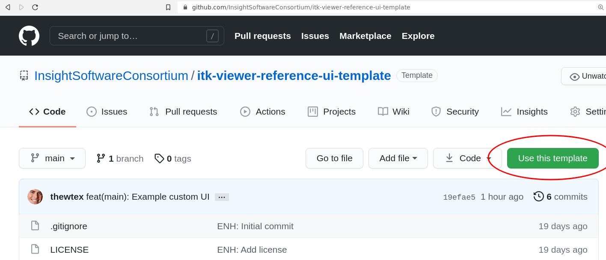
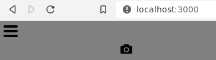
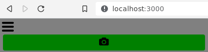

title: User Interface (UI) Customization
---

The viewer's user interface (UI) is completely customizable. An existing viewer user interface can be tweaked, or a new user interface can be built from scratch. Use vanilla HTML/CSS/JavaScript or your favorite UI framework, such as React.js or Vue.js.

The user interface is specified on viewer creation with a JavaScript object or an object that specifies an [ES Module](https://developer.mozilla.org/en-US/docs/Web/JavaScript/Guide/Modules). The UI object should contain functions that implement **actions** called as UI [state machines](https://xstate.js.org/docs/) respond to events. Nested objects provide actions for child state machines. A few example actions are `toggleDarkMode` or `toggleUICollapsed`.

Each [action function](https://xstate.js.org/docs/about/glossary.html#action) is expected to accept two arguments: `context` and `event`.

The `context` is the current state machine context. A `context` object is comprised of the context generated by the [viewer configuration](../config/) and additional objects generated by the UI or renderer. For example, the `createInterface` action may add a `div` property to the `context` for the UI that other UI actions may reference later.

The `event` argument is the current event object that triggered the action. An `event` object contains the event name, an upper case string by convention. Optionally, the `event` may contain a payload in the `data` property. In addition to responding to events, a UI implementation will trigger events from user input and pass those events to the state machine by calling `context.service.send(<triggeredEvent>)`. For example,

```
collapseUIButton.addEventListener('click', () => { context.service.send('TOGGLE_UI_COLLAPSED'))
```

## UI options architecture

**Warning**: the viewer machine's architecture is experimental and it is subject to change without modification to the major version of the package. We mean it!

Available actions can be observed in the [Reference UI Machine Options](https://github.com/Kitware/itk-vtk-viewer/blob/master/src/UI/reference-ui/src/referenceUIMachineOptions.js). If an action is not implemented, it is a no-op. Nested options objects correspond to the nested state machines. They are:

* [`main`](https://github.com/Kitware/itk-vtk-viewer/blob/master/src/UI/Reference/Main/mainUIMachineOptions.js): UI components impacting the entire viewer's state. For example, the UI to toggle fullscreen mode or change the viewer's background color.
* [`layers`](https://github.com/Kitware/itk-vtk-viewer/blob/master/src/UI/Reference/Layers/layersUIMachineOptions.js): UI components related to dataset layers. For example, the UI to select a layer or toggle its visibility.
* [`widgets`](https://github.com/Kitware/itk-vtk-viewer/blob/master/src/UI/Reference/Widgets/widgetsUIMachineOptions.js): UI components for interactive widget parameters. For example, display the current distance measured by a distance widget.
* [`images`](https://github.com/Kitware/itk-vtk-viewer/blob/master/src/UI/Reference/Images/imagesUIMachineOptions.js): UI components related to the currently selected image layer. For example, the current color map used.
* `geometries` (todo): UI components related to the currently selected geometry layer. For example, the current geometry opacity.
* `pointSets` (todo): UI components related to the currently selected point set layer. For example, the current point set opacity.

## Example: Main UI with only a screenshot button

This example demonstrates how to customize the `reference` UI so the `main` interface only presents a screenshot button.

### Create repository

Let's create a repository for our interface.

Either use the *Use this template* button on the [itk-viewer-reference-ui-template GitHub repository](https://github.com/InsightSoftwareConsortium/itk-viewer-reference-ui-template):



or use the template repository on the command line:

```
npx degit InsightSoftwareConsortium/itk-viewer-reference-ui-template my-viewer-ui
```

### Edit interface

To create our interface, first install the Node.js packages:

```
cd my-viewer-ui
npm ci
```

Then start the development server:

```
npm run dev
```

And visit *http://localhost:3000* in your web browser. The template has customized the viewer's [Reference UI](https://www.npmjs.com/package/itk-viewer-reference-ui) to only present a screenshot button in the viewer's main interface. The main interface is customized with the `createMainInterface` action.

```
import referenceUIMachineOptions from 'itk-viewer-reference-ui/src/referenceUIMachineOptions.js'
import style from 'itk-viewer-reference-ui/src/ItkVtkViewer.module.css'
import createScreenshotButton from 'itk-viewer-reference-ui/src/Main/createScreenshotButton.js'

function modifiedCreateMainInterface(context) {
  const mainUIGroup = document.createElement('div')
  mainUIGroup.setAttribute('class', style.uiGroup)
  context.uiGroups.set('main', mainUIGroup)

  const mainUIRow1 = document.createElement('div')
  mainUIRow1.setAttribute('class', style.mainUIRow)
  mainUIGroup.appendChild(mainUIRow1)

  createScreenshotButton(context, mainUIRow1)

  context.uiContainer.appendChild(mainUIGroup)
}
```



We re-use the rest of the user interface machine actions:

```
const uiMachineOptions = { ...referenceUIMachineOptions }

const uiMainActions = { ...uiMachineOptions.main.actions }
uiMainActions.createMainInterface = modifiedCreateMainInterface

const uiMain = { ...uiMachineOptions.main }
uiMain.actions = uiMainActions
uiMachineOptions.main = uiMain
```

And use the `uiMachineOptions` as the default module export:

```
export default uiMachineOptions
```

Let's make the background of the main user interface green by editing *main.js*:

```
  [...]
  createScreenshotButton(context, mainUIRow1)

  // Add this line
  mainUIGroup.style.backgroundColor = "green"

  context.uiContainer.appendChild(mainUIGroup)
  [...]
```

After saving *main.js*, the page will reload with our change applied:



### Publish the UI module

Exit the development server with *Ctrl+C* if still open, then build a production version of the user interface module:

```
npm run build
```

This builds the module `dist/referenceUIMachineOptions.js.es.js`.

We can publish our interface to [npmjs.com](https://www.npmjs.com/). First change the package `name` in the *package.json* file to something unique:

```
{
  "version": "0.1.0",
  "name": "my-viewer-ui",
  "scripts": {
```

Then publish the package:

```
npm login
npm publish
```

After published and propagated on the network, your package is available for download. The package files are also served by services like [jsdelivr](https://jsdelivr.com) (better for production use) or [unpkg](https://unpkg.com) (better for testing). Use your user interface by specifying it in the [viewer config](../config.html):

```
const uiMachineOptions = { href: "https://cdn.jsdelivr.net/npm/itk-viewer-reference-ui-template@0.1.2/dist/referenceUIMachineOptions.js.es.js" }
// or
// const uiMachineOptions = { href: "https://unpkg.com/itk-viewer-reference-ui-template@0.1.2/dist/referenceUIMachineOptions.js.es.js" }
itkVtkViewer.createViewer(container,
  {
  image: ipfsImage,
  rotate: false,
  config: { uiMachineOptions },
  })
```
