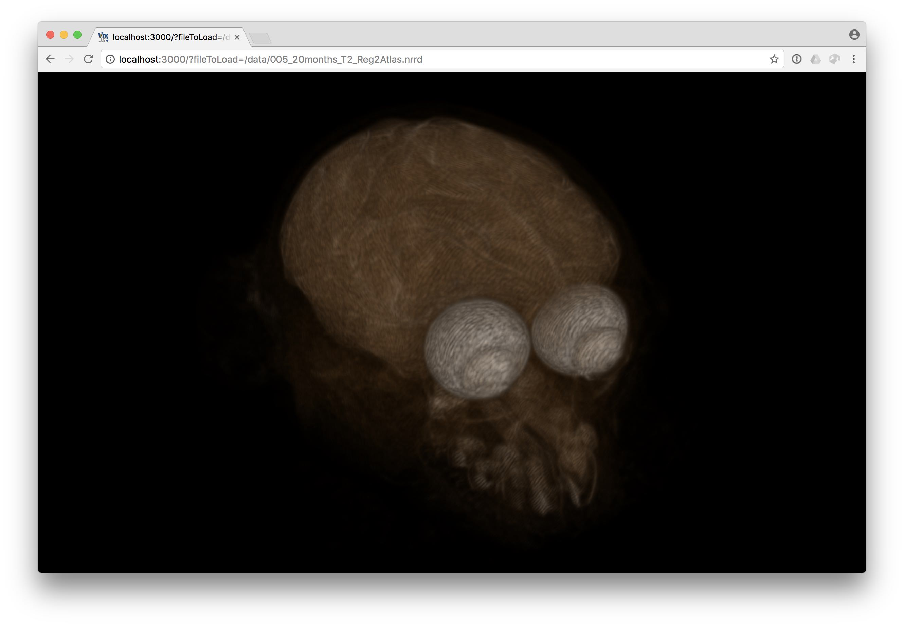

title: Progressive Web App
---

The [default ITK/VTK Viewer page](https://kitware.github.io/itk-vtk-viewer/app/) lets you drag and drop or select a data file from your local filesystem to visualize. Once you have loaded data with this [progressive web app](https://en.wikipedia.org/wiki/Progressive_Web_Apps), the app will also work offline.

Additionally, visualization links for data files available on the web can be created by providing extra arguments to the app URL. The resulting link can be quickly shared to distribute interative visualizations for your data.

For example,

<label for="dataVisualizationLink"><a href="https://kitware.github.io/itk-vtk-viewer/app/?fileToLoad=https://data.kitware.com/api/v1/file/564a65d58d777f7522dbfb61/download/data.nrrd" target="_blank" id="linkForNewTab">Visualization link:</a></label>
<textarea name="dataVisualizationLink" id="dataVisualizationLink" rows="1" cols="100" wrap="off" readonly></textarea>
<button onclick="copyLinkToClipboard()">Copy to clipboard</button>

<label for="dataURL">Enter an image, mesh, or point set file URL:</label>
<input type="url" name="dataURL" id="dataURL" placeholder="https://data.kitware.com/api/v1/file/564a65d58d777f7522dbfb61/download/data.nrrd" size="100" required oninput="generateDataVisualizationLink()" />

 

The extra argument, `?fileToLoad=[...]`, uses a full `http://` url to the data file.

An additional parameter can be added to force the slice viewing mode. Just add `?use2D` or `?fileToLoad=[..]&use2D` inside the URL.

